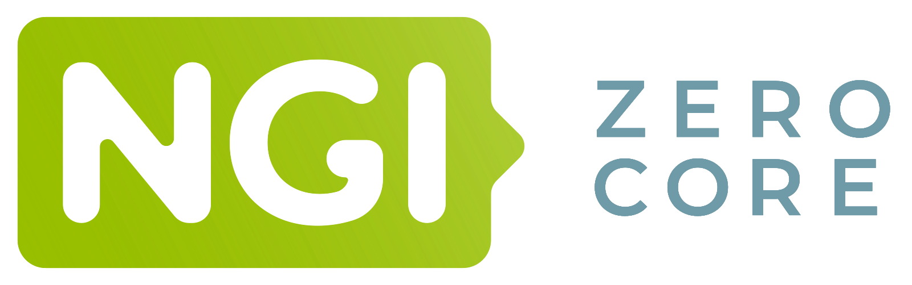

You can find these instructions on the [official web page](https://goupile.org).

# Overview

Goupile is an **open-source electronic data capture application** that strives to make form creation and data entry both powerful and easy.

This project is sponsored by NLnet: https://nlnet.nl/project/Goupile/

    &nbsp;&nbsp;&nbsp;
    
      

You can test it directly on our online demo instance : <a href="https://demo.goupile.fr/" target="_blank">test online demo</a>

> [!WARNING]
> Please note that sessions and data in the demo version are regularly reset to zero!

We also offer [paid hosting services](https://goupile.org/pricing) based on Goupile suited to your needs, see the pricing page or contact us for more information.

Visit the [official goupile.org website](https://goupile.org) for more information.

# Source code

This repository does not contain the code of Goupile but only exists as a front. For pratical reasons, I've started using a single repository for all my projects in 2018 because it is easier to manage.

The source code is available here: https://github.com/Koromix/rygel/ (in the *src/goupile* subdirectory).

Monorepositories have two killer features for me:

- Cross-project refactoring
- Simplified dependency management

You can find a more detailed rationale here: https://danluu.com/monorepo/